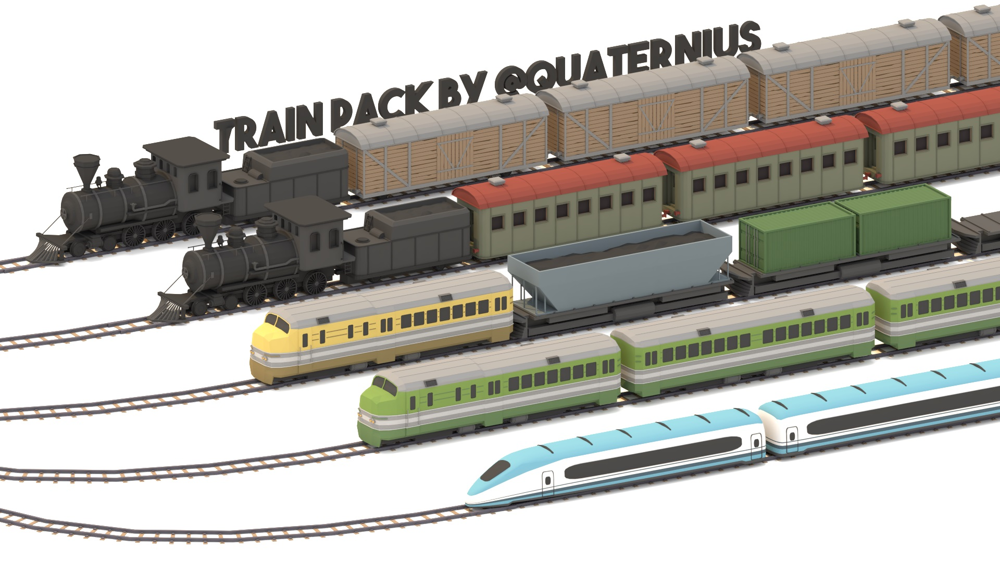

# Railway The Game: Fried but not Roasted

This is my gamedev n00b experiment to try out [Fyrox] game engine and especially it's binaural / [HRTF] capabilities.

In this game you play as the protagonist conductor Vin to liberate all the trains from their fried chicken.

This all the while you try to dodge the antagonist conductor Brody who is tirelessly trying to run over you - you guessed - with a train!

The more you eat the fried chicken the more hungry you become.

The binaural and HRTF capabilities are essential to create mechanic where you can sense sonically where the trains come from as these can come from your behind - or even from top or bottom - a 4D chess game if you call it.

# Elements

Most elements 3D model selection / design favor "LowPoly" style

## Vin (Character)

Protagonist - Model TBD

## Brody (Character)

Antagonist - Model TBD

## Tracks + Train (Vehicle)

Model: CC0 - Train Pack by [Quaternius](http://quaternius.com/) ([Gdrive](https://drive.google.com/drive/folders/15UgTB4JZgsSxdBDTTk0Qv1iiCbH9bdMk), [r/gamedev](https://www.reddit.com/r/gamedev/comments/bm0898/free_lowpoly_trains_and_tracks/), )

# Scenes

## Train Yard

Evolving 4D train yard. Tracks build themselves in front of trains.

Trains can come from top and bottom and often at distance where Vin has to run to catch the trains.

[Fyrox]: https://github.com/FyroxEngine/Fyrox
[HRTF]: https://github.com/mrDIMAS/hrtf